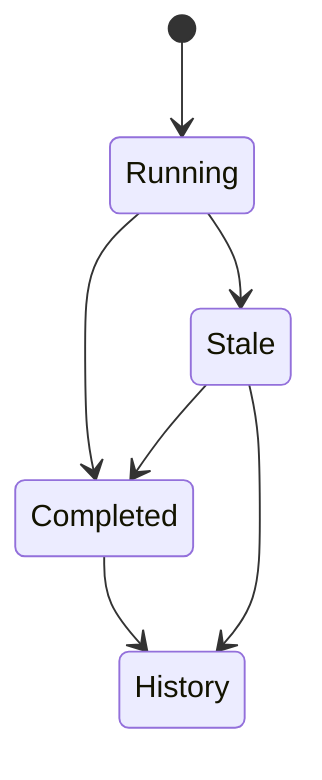

# mahjong 路线图

mahjong 的长期方向是成为一个本地优先的 AI Agent 工作状态伴侣：安静、可信、可扩展，并且容易参与贡献。

## 产品北极星

> 一个用麻将牌状态展示 AI Agent 正在做什么的本地桌面伴侣。

核心原则：

- 默认本地优先、只读观察。
- 提供清晰的隐私控制。
- Provider 的行为需要可解释。
- 先做好小而高频的日常使用体验，再考虑复杂编排能力。
- 新增 Provider 应该有文档、有测试、易于 Review。

## 阶段总览

| 阶段 | 版本 | 目标 | 主要产出 |
| --- | --- | --- | --- |
| 0 | 当前 | 保持基线健康 | App 可构建、测试通过、开源基础设施齐备。 |
| 1 | 0.1.x | 让首次使用可信 | Settings、Provider 开关、诊断信息、首个 Release 包。 |
| 2 | 0.2.x | 让工程基础可扩展 | Provider 注册表、拆分 UI 组件、fixture 测试、标准化状态。 |
| 3 | 0.3.x | 让它成为日常工具 | 首次启动引导、通知、菜单栏模式、未来计划记录。 |
| 4 | 0.4.x | 让外部贡献更容易 | Provider 开发文档、Issue 标签、good first issue、更多 Provider。 |
| 5 | 0.5.x | 让分发体验成熟 | 签名/公证构建、DMG、可重复的 Release 自动化。 |
| 6 | 1.0 | 稳定产品承诺 | 可靠的本地观察工具，具备清晰隐私边界和扩展模型。 |

## 路线图流向


## 阶段详情

### 阶段 0：当前基线

| 模块 | 状态 |
| --- | --- |
| macOS 麻将牌桌宠 | 已完成 |
| mahjong Board | 已完成 |
| Codex / Claude / Claude Desktop / Hermes 支持 | 初始支持 |
| Terminal / Desktop runtime 检测 | 初始支持 |
| README / LICENSE / CONTRIBUTING / SECURITY | 已完成 |
| CI 和基础测试 | 已完成 |

验收标准：

- `swift build` 通过。
- `swift test` 通过。
- `main` 分支保持可发布状态。

### 阶段 1：可信首次使用

目标版本：`0.1.x`

| 优先级 | 工作项 | 原因 |
| --- | --- | --- |
| P0 | Settings 页面 | 已有基础设置页，后续继续打磨首次使用解释。 |
| P0 | Provider 启用/禁用开关 | 已支持选择 mahjong 读取哪些来源。 |
| P0 | Provider Diagnostics | 已展示路径缺失、关闭、无数据和读取结果状态。 |
| P0 | 隐私模式 | 已隐藏任务标题、摘要、模型、Token 和诊断路径细节。 |
| P0 | README 截图/GIF | 视觉型产品需要直观展示。 |
| P0 | GitHub Release `.zip` | 已有 `script/build_release_zip.sh` 生成 `.build/dist/mahjong.zip`。 |

建议的 Settings 项：

- Provider 开关。
- 刷新间隔。
- 显示/隐藏 Token usage。
- 显示/隐藏本地项目名。
- 隐私模式。

Diagnostics 应展示：

- 数据路径不存在。
- 权限不足。
- Schema 不支持。
- 外部工具不可用，例如 `sqlite3`。
- 读取成功，但没有发现 session。

验收标准：

- 新用户能在 5 分钟内运行 App。
- 每个 Provider 都可以被关闭。
- Provider 失败原因能在 UI 里看到。
- 有 Release notes 和可下载构建产物。

### 阶段 2：可扩展工程基础

目标版本：`0.2.x`

| 优先级 | 工作项 | 原因 |
| --- | --- | --- |
| Done | 引入 `AgentProviderDescriptor` | Provider 元数据已集中管理。 |
| Done | 拆分 `BoardView.swift` | 主视图已拆成侧栏、任务列、任务卡、运行列表、设置和未来计划视图。 |
| Done | 增加 fixture 测试 | Codex、Claude CLI、Claude Desktop、Hermes 均有本地数据夹具覆盖。 |
| Done | 增加标准化状态 | 任务状态已区分进行中、已完成、已中断、已归档。 |
| Done | 标准化 Provider ID | 设置、诊断、任务和运行态均使用稳定 Provider ID。 |

建议的 Provider descriptor 字段：

```swift
struct AgentProviderDescriptor {
    let id: String
    let displayName: String
    let defaultEnabled: Bool
    let dataPaths: [String]
    let privacyDescription: String
}
```

推荐的 UI 拆分：

| 组件 | 职责 |
| --- | --- |
| `BoardView` | 整体布局和 Tab 路由 |
| `TaskColumnView` | 状态列 |
| `TaskCardView` | 单个任务卡片 |
| `AgentRuntimeListView` | 运行中的 Agent 列表 |
| `FutureTasksView` | 未来计划快速记录界面 |
| `AgentIconResolver` | Provider 图标解析 |

状态模型方向：



验收标准：

- 已完成：新增 Provider 元数据集中在 `AgentProviderDescriptor`。
- 已完成：新增 Provider 不需要修改无关 UI 文件。
- 已完成：Parser 变更有 fixture 测试覆盖。
- 已完成：UI 能展示用户可理解的任务结果状态。

### 阶段 3：日常使用体验

目标版本：`0.3.x`

| 优先级 | 工作项 | 原因 |
| --- | --- | --- |
| P1 | 首次启动引导 | 在用户担心前解释数据访问边界。 |
| P1 | 菜单栏模式 | 即使 Board 关闭，也能看到关键状态。 |
| P1 | 可选完成通知 | Agent 完成任务时提醒用户。 |
| P1 | 未来计划记录 | 快速记录未来打算做的计划，不绑定 Agent 分类。 |
| P1 | 任务操作 | 帮助用户快速回到当前工作。 |

建议的任务操作：

- 在 Finder 中显示 session。
- 复制 session 路径。
- 复制任务标题。
- 打开 Provider App。
- 复制未来计划内容。
- 将未来计划标记为完成或待处理。

验收标准：

- 用户不读文档也能理解 App 在做什么。
- App 可以全天常驻，且不打扰。
- 未来计划是低摩擦的本地计划记录入口。

### 阶段 4：贡献者增长

目标版本：`0.4.x`

| 优先级 | 工作项 | 原因 |
| --- | --- | --- |
| P1 | `docs/provider-development.md` | 降低 Provider PR 的门槛。 |
| P1 | Good first issues | 给新贡献者低摩擦入口。 |
| P1 | Issue 标签体系 | 帮贡献者快速找到合适的工作。 |
| P1 | 更多 Provider 支持 | 通过社区 PR 扩大项目价值。 |

推荐标签：

- `provider`
- `privacy`
- `parser`
- `ui`
- `good first issue`
- `help wanted`
- `release`

候选 Provider：

| Provider | 初始范围 |
| --- | --- |
| Aider | 本地 session 或进程检测 |
| OpenCode | 本地 session 或进程检测 |
| Gemini CLI | 进程和本地 metadata 检测 |
| Cursor / Windsurf | 先做 Desktop app / runtime 检测 |
| Goose / Continue | 如果本地 metadata 安全可用，则读取 metadata |

验收标准：

- 贡献者能根据文档新增 Provider。
- 新 Provider 包含测试。
- Issue 能按贡献类型轻松浏览。

### 阶段 5：成熟分发

目标版本：`0.5.x`

| 优先级 | 工作项 | 原因 |
| --- | --- | --- |
| P1 | 自动化 Release 构建 | 让发布流程可重复。 |
| P1 | `.dmg` 打包 | 改善安装体验。 |
| P1 | Code signing | 降低用户打开 App 的阻力。 |
| P1 | Notarization | 提升 macOS 信任体验。 |
| P2 | Changelog 自动化 | 让 Release notes 更稳定。 |
| P2 | Sparkle 自动更新 | Release 流程稳定后再考虑。 |

验收标准：

- 用户能下载并打开 App，Gatekeeper 摩擦较低。
- Release 产物能稳定生成。
- 每次 Release 都有 notes 和构建产物。

### 阶段 6：1.0 稳定产品承诺

目标版本：`1.0`

1.0 应包含：

- 稳定的 Provider registry。
- Settings 和 Provider 开关。
- Provider Diagnostics。
- 隐私模式。
- 可靠的 Release 包。
- 核心 Provider fixture 测试。
- 清晰的数据访问文档。
- 贡献者文档。
- 安静、稳定、适合日常使用的 UI。

1.0 前不优先做：

- 自动控制 Provider 执行任务。
- 云同步。
- 完整对话正文展示。
- 复杂任务编排。
- 登录系统。
- 插件市场。

## 推荐执行顺序

| 顺序 | 版本 | 里程碑 |
| --- | --- | --- |
| 1 | 0.1.0 | Settings、Provider 开关、隐私模式、release zip 脚本已落地；README 截图待补 |
| 2 | 0.1.1 | Provider Diagnostics 已落地；后续继续增强错误细节 |
| 3 | 0.2.0 | `AgentProviderDescriptor`、UI 拆分已落地 |
| 4 | 0.2.1 | Claude 和 Hermes fixture 测试已落地 |
| 5 | 0.3.0 | 首次启动引导、未来计划记录 |
| 6 | 0.3.1 | 通知、菜单栏模式 |
| 7 | 0.4.0 | Provider 开发文档、good first issues |
| 8 | 0.5.0 | Release 打包、签名、公证 |

## 最高优先级 Backlog

| 优先级 | Issue 标题 |
| --- | --- |
| Done | Add Settings page for provider toggles |
| Done | Add provider diagnostics panel |
| Done | Add privacy mode |
| P0 | Add screenshot and demo GIF to README |
| Done | Introduce `AgentProviderDescriptor` |
| Done | Split `BoardView` into smaller components |
| P1 | Add first-run onboarding |
| Done | Add Claude provider fixture tests |
| Done | Add Claude Desktop provider fixture tests |
| Done | Add Hermes sqlite fixture tests |
| P1 | Add provider development guide |
| Done | Add GitHub release packaging script |
| P2 | Add signed and notarized macOS release flow |
